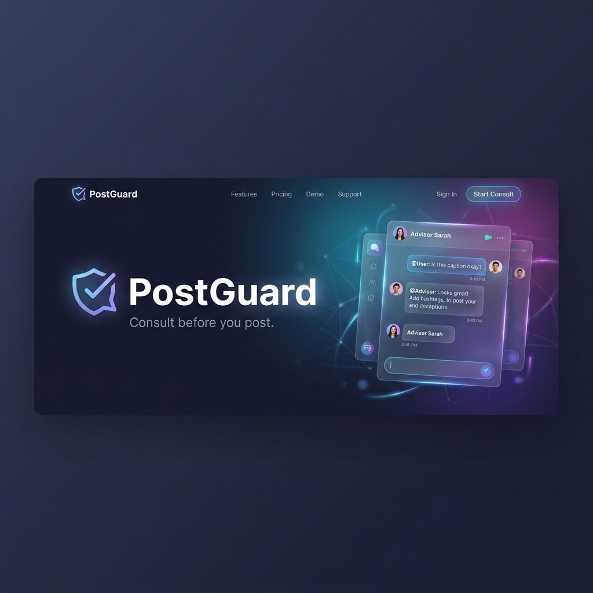

# PostGuard - SNS投稿前相談アプリ




PostGuardは、SNSに投稿する前の文章をAI（LLM）が客観的に評価し、炎上リスクや誤解を未然に防ぐための相談アプリです。

## 🌟 主な機能

- **投稿内容の多角的な評価**: 入力された文章を以下の3つの指標（0〜5点満点）で評価します。
  - **攻撃性**: 他者を攻撃したり、不快にさせる要素が含まれていないか。
  - **特定可能性**: 個人、場所、所属などが特定されるリスクがないか。
  - **誤解されやすさ**: 文脈不足や意図しない解釈をされる恐れがないか。
- **改善案の提案**: 評価結果に基づき、より安全で伝わりやすい表現をAIが提案します。
- **柔軟なLLM連携**: OpenAI API（GPT-4o等）とOllama（ローカルLLM）の両方に対応しています。
- **直感的なUI**: チャット形式のインターフェースで、AIと対話するように投稿内容をブラッシュアップできます。

## 🚀 クイックスタート

### 前提条件

- Python 3.8以上
- OpenAI APIキー または [Ollama](https://ollama.com/) のインストール

### インストール

1. リポジトリをクローンします。
   ```bash
   git clone https://github.com/djanzu/presns.git
   cd presns
   ```

2. 仮想環境を作成し、依存関係をインストールします。
   ```bash
   python -m venv .venv
   source .venv/bin/activate  # macOS/Linuxの場合
   # .venv\Scripts\activate  # Windowsの場合
   pip install -r requirements.txt
   ```

### 設定

1. `.env.example` を `.env` にコピーします。
   ```bash
   cp .env.example .env
   ```

2. `.env` ファイルを編集し、使用するLLMの設定を行います。

   **OpenAIを使用する場合:**
   ```env
   LLM_TYPE=openai
   OPENAI_API_KEY=your_api_key_here
   OPENAI_MODEL=gpt-4o
   ```

   **Ollamaを使用する場合:**
   ```env
   LLM_TYPE=ollama
   OLLAMA_BASE_URL=http://localhost:11434
   OLLAMA_MODEL=gemma:latest
   ```

### 実行

サーバーを起動します。
```bash
python main.py
```

ブラウザで `http://localhost:8000` にアクセスしてください。

## 🛠️ 技術スタック

- **Backend**: FastAPI, LangChain, Pydantic, python-dotenv
- **Frontend**: Vanilla HTML/JS/CSS (Responsive Design)
- **LLM Integration**: LangChain OpenAI / LangChain Ollama

## 📅 今後のロードマップ (TBD)

- **過去の発言との整合性チェック**: 以前の投稿内容を取得し、キャラ崩れや矛盾がないか評価。
- **トーン＆マナー学習**: ユーザー固有の言い回し（自分らしさ）を学習し、それに沿った修正案を提示。
- **プライバシー保護の強化**: 位置情報や機密情報の混入をより高精度に検知。

## 📄 ライセンス

[MIT License](LICENSE)
